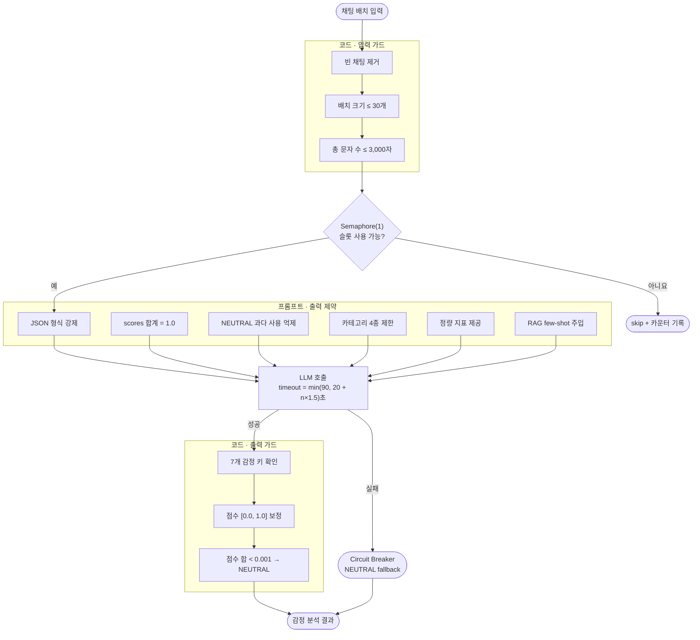

# 각(Gak) — 치지직 스트리머용 VOD 하이라이트 추출 및 방송 보조 도구

**개발 기간:** 2026.02.25 ~ 2026.05.18

치지직 스트리머의 VOD에서 **편집 후보 구간을 자동으로 추출**하고, 투표·룰렛·실시간 반응 확인 등 **라이브 방송 보조 기능**을 제공하는 서비스입니다.

---

## 미리보기

### VOD 하이라이트 추출

<p align="center">
  
</p>

### 민심 체크

<p align="center">
  
  <br/>
  
</p>

---

## ✨ 주요 화면

| 🔐 로그인 | 🎬 VOD 하이라이트 | 🎯 투표 | 🎲 룰렛 | 💬 민심 |
|:---:|:---:|:---:|:---:|:---:|
|  |  |  |  |  |
| CHZZK OAuth 로그인 | 편집 후보 구간 자동 추출 | 채팅 기반 투표 | 도네이션 가중 룰렛 | 실시간 채팅 반응 확인 |

---

## 🚀 핵심 기능

### 🔒 인증 및 세션 관리

- CHZZK OAuth 로그인
- HMAC-SHA256 서명 검증
- Redis에 인증 세션을 바인딩해 토큰을 즉시 폐기할 수 있도록 구성

### 💬 실시간 채팅

- 치지직 채팅 실시간 수집
- `!투표 N` 명령을 이용한 실시간 투표
- 채팅 기록 조회 및 방송 반응 분석

### 🎬 VOD 분석 및 하이라이트 추출

- 채팅 빈도와 분위기 변화를 이용해 편집 후보 구간 추출
- 시간대별 후보 분산으로 영상 앞부분에 후보가 집중되는 현상 완화
- 과거 승인·거절 하이라이트를 검색해 LLM 판단에 few-shot 사례로 활용
- 실시간 채팅 패턴과 과거 하이라이트의 유사도를 비교해 관련 구간 알림

감정은 다음 7개 레이블로 분류합니다.

`JOY` · `HOPE` · `WONDER` · `HYPE` · `SADNESS` · `ANGER` · `DISGUST`

`NEUTRAL`은 별도의 감정 레이블이 아니라 다음 두 상황을 표현하는 시스템 상태값으로 사용합니다.

1. 특정 감정이 우세하지 않아 분류하기 어려운 경우
2. LLM 장애 또는 출력 검증 실패로 정상적인 판단을 완료하지 못한 경우

따라서 `NEUTRAL`은 단순히 **감정이 없음**을 의미하지 않습니다.

### 🎯 투표 및 룰렛

- 투표 시작·종료를 분리한 실시간 투표
- 투표 중 발생한 채팅 기록 조회
- 도네이션 금액에 비례한 가중치 기반 룰렛

---

## 🏗️ 아키텍처

```text
Browser
 └─ Next.js (3000)              ← UI + API Proxy
      ├─ /api/chzzk/*  → collector (8081)   ← 로그인, 채팅 수집, VOD 크롤링
      └─ /api/v1/*     → core-api  (8083)   ← 분석 결과, SSE, 접근 제어

 collector (8081)                  analyzer (8082)                core-api (8083)
 채팅 수집 · VOD 크롤링  ─Kafka─►  감정 분석 · 편집 후보 계산  ─Kafka─►  저장 · SSE · 접근 제어
       │                                                                  │
       │◄──────── vod-analysis-complete/failed-topic ──────────────────────┤
       │                                                                  │
       │                                                             PostgreSQL
       │                                                             + pgvector
       │
       └───────────────────────────────────────────────────────────── Redis
                                                                     세션 · 실시간 집계
```

서비스는 역할에 따라 세 영역으로 분리했습니다.

- **collector**: 로그인, 채팅 수집, VOD 데이터 수집
- **analyzer**: 감정 분석, 하이라이트 후보 계산, 임베딩 생성
- **core-api**: 분석 결과 저장, 접근 제어, SSE 전송

서비스 간 비동기 작업은 Kafka 이벤트로 전달합니다.

---

## ⚡ 핵심 설계 및 문제 해결

### 1. 비결정적인 LLM 출력을 서비스에서 안전하게 처리하기

LLM 감정 분석 결과에서는 다음과 같은 오류가 발생할 수 있었습니다.

- JSON 필드 누락
- 허용 범위를 벗어난 점수
- 모든 감정 점수가 `0.0`으로 반환되는 결과
- 응답 지연 또는 호출 실패

잘못된 LLM 응답 하나가 전체 분석 배치를 중단하지 않도록 **입력 검증, 프롬프트 제약, 출력 검증, 장애 복구**를 각각 분리했습니다.

#### 코드 레벨 가드레일

| 단계 | 처리 |
|---|---|
| 입력 검증 | 빈 채팅 제거 → 최대 30개로 배치 제한 → 전체 입력 3,000자로 제한 |
| 출력 검증 | 7개 감정 점수 존재 여부 확인 → 점수를 `[0.0, 1.0]` 범위로 보정 → 전체 합이 0에 가까우면 `NEUTRAL` 처리 |
| 동시성 제어 | `Semaphore(1)`로 동시 호출 제한 → 채팅 수에 따라 호출 제한 시간 계산 |
| 장애 복구 | Circuit Breaker를 적용하고 LLM 호출 실패 시 `NEUTRAL` fallback |

#### 프롬프트 레벨 제약

잘못된 결과를 사후 처리하는 것만으로는 부족하다고 판단해 `resources/prompts/`의 프롬프트에도 출력 조건을 명시했습니다.

- **JSON 형식 고정**  
  Ollama API의 `format: "json"` 옵션과 시스템 프롬프트의 JSON 출력 규칙을 함께 적용

- **점수 합계 제약**  
  각 `messageId`의 감정 점수 합이 `1.0`이 되도록 명시

- **NEUTRAL 과다 분류 억제**  
  판단 가능한 경우 가장 지배적인 감정을 선택하도록 지시

- **키워드 할루시네이션 방지**  
  실제 입력 채팅에 등장한 표현만 키워드로 추출하도록 제한

- **하이라이트 판단 기준 부여**  
  게임 하이라이트 편집자의 관점에서 편집 후보를 판단하도록 역할과 기준 제공

- **카테고리 제한**  
  `슈퍼플레이`, `대참사`, `운`, `소통` 네 가지 범주만 허용

- **정량 지표 제공**  
  Z-Score, `densityRatio`, `laughRatio` 등을 프롬프트에 포함해 채팅 인상만으로 판단하지 않도록 구성

- **RAG few-shot 적용**  
  과거 승인·거절 하이라이트 중 유사 사례를 검색해 판단 예시로 제공



가드레일을 적용하기 전에는 JSON 파싱 실패가 전체 배치 실패로 이어지거나, 모든 감정 점수가 `0.0`으로 반환돼 전체 채팅이 `NEUTRAL`로 집계되는 문제가 있었습니다.

입력과 출력 검증을 분리하고 fallback 경로를 추가해 **LLM의 비결정적인 응답을 서비스 오류와 분리했습니다.**

---

### 2. 채팅 패턴을 이용한 하이라이트 검색

초기에는 pgvector를 VOD 하이라이트 RAG에 사용했습니다.

과거 승인·거절 사례와 현재 후보 구간의 임베딩을 비교해 유사한 사례를 LLM 프롬프트에 제공하는 방식입니다.

이후 실시간 유사 하이라이트 알림을 추가하면서 검색 대상이 단순한 정량 점수에서 **채팅 패턴의 의미적 유사성**으로 확장됐습니다.

실시간 알림에서는 다음 정보를 함께 사용합니다.

- EMA 기반 채팅 스파이크
- 주요 키워드
- 앵커 채팅
- 과거 하이라이트 임베딩

현재 채팅 패턴을 임베딩한 뒤 pgvector에서 cosine similarity를 계산해 유사한 과거 하이라이트를 검색합니다.

```text
채팅 입력
  ↓
EMA 스파이크 감지
  ↓
패턴 임베딩 생성
  ↓
pgvector 유사도 검색
  ↓
SSE 알림
```

이 경로는 비동기 Reactive Chain으로 분리했습니다.

따라서 유사 하이라이트 검색이나 SSE 전송에 실패해도 메인 `v2_frame` 전송 경로는 계속 동작합니다.

---

### 3. 분산 환경을 고려한 동시성 제어

VOD 분석 슬롯을 애플리케이션 메모리에서 관리하면 서버 인스턴스마다 서로 다른 카운터를 가지게 됩니다.

여러 인스턴스에서도 동일한 상태를 공유할 수 있도록 **Redis 카운터와 TTL을 이용해 VOD 동시 실행 수를 관리했습니다.**

Kafka 이벤트는 스트리머 방송 ID를 파티션 키로 사용합니다.

같은 방송에서 발생한 이벤트는 동일한 파티션으로 전달되므로 방송 단위의 메시지 처리 순서를 유지할 수 있습니다.

---

### 4. 장애 대상에 따라 다른 Redis 실패 전략 적용

모든 Redis 장애를 같은 방식으로 처리하지 않았습니다.

보호해야 하는 대상에 따라 실패 전략을 분리했습니다.

| 대상 | 장애 전략 | 이유 |
|---|---|---|
| 인증 | `fail-secure` | 세션 상태를 확인할 수 없으면 요청을 허용하지 않음 |
| VOD 슬롯 제한 | `fail-open` | 슬롯 상태 확인 실패가 전체 VOD 분석 중단으로 이어지지 않도록 처리 |

인증에서는 보안을 우선하고, VOD 분석 슬롯에서는 서비스 가용성을 우선하도록 장애 정책을 나눴습니다.

---

## 🤖 AI 개발 워크플로우

### Plan-First + Human Approval Gate

AI가 바로 코드를 수정하지 않고 **변경 계획을 먼저 작성한 뒤 사람이 승인한 경우에만 구현을 시작하도록 규칙을 구성했습니다.**

```text
EnterPlanMode
   ↓
변경 범위 · 영향 파일 · 대안 정리
   ↓
ExitPlanMode
   ↓
사람 승인
   ↓
구현
```

`CLAUDE.md`에 다음 규칙을 정의했습니다.

- 승인 전 파일 수정 금지
- 구현 전 영향 파일과 변경 범위 작성
- 주요 변경은 `docs/design/`에 설계 문서로 기록
- 설계 변경의 이유와 대안을 함께 보존

이를 통해 AI가 요청 범위를 벗어난 파일까지 변경하는 상황을 줄이고, 이후에도 설계 판단의 배경을 확인할 수 있도록 했습니다.

---

### Researcher / Planner / Reviewer 분리

코드 탐색, 구현 계획, 검토를 하나의 AI 컨텍스트에서 처리하지 않고 **세 개의 독립된 Claude API 호출**로 분리했습니다.

```text
Researcher  ──보고서──▶  Planner  ──계획서──▶  Reviewer  ──판정──▶  구현
읽기 전용                도구 없음               읽기 전용
```

각 에이전트의 역할과 권한을 제한했습니다.

- **Researcher**
  - `read_file`
  - `list_directory`
  - `grep_code`
  - 코드 수정 권한 없음

- **Planner**
  - Researcher의 결과를 바탕으로 구현 단계 작성
  - 위험 요소와 롤백 전략 작성
  - 별도 코드 탐색 도구 없음

- **Reviewer**
  - 구현 계획과 실제 코드 구조 비교
  - 위험 요소를 🔴 / 🟡 / 🟢으로 분류
  - 최종 결과를 ✅ / ⚠️ / ❌로 판정

Claude Code에서는 다음 명령으로 전체 워크플로우를 실행할 수 있습니다.

```bash
/workflow "작업 설명"
```

실행 코드는 `scripts/run_workflow.py`에 있습니다.

---

### Prompt 및 실행 로그 기록

각 에이전트 실행 정보를 파일로 기록해 같은 실행 조건을 다시 확인하고 오류 원인을 추적할 수 있도록 했습니다.

실행마다 다음 경로가 생성됩니다.

```text
workflow_logs/<timestamp>_<run_id>/
```

| 파일 | 내용 |
|---|---|
| `events.jsonl` | API 호출, 도구 호출, 오류, 토큰 수 등 전체 이벤트 |
| `prompts/*.txt` | 각 에이전트에 전달한 시스템 프롬프트와 사용자 메시지 |
| `summary.md` | 반복 횟수, 실행 시간, 토큰 사용량, 도구 호출 내역 |

프롬프트와 실행 로그를 함께 보관해 **어떤 입력과 조건에서 결과가 생성됐는지 다시 확인할 수 있도록 했습니다.**

---

## 🛠️ 기술 스택

| 영역 | 기술 |
|---|---|
| Frontend | Next.js 15, TypeScript, Tailwind CSS |
| Backend | Spring Boot WebFlux, Java 17 |
| 메시지 브로커 | Apache Kafka |
| 캐시·세션 | Redis 7 |
| Database | PostgreSQL 15, pgvector |
| LLM | Ollama, `nomic-embed-text`, 감정 분석 모델 |
| 인프라 | Docker Compose, Resilience4j Circuit Breaker |

---

## 💻 로컬 실행

### 사전 준비

다음 환경이 필요합니다.

- Docker Desktop
- JDK 17
- Node.js

`backend/.env`에 CHZZK OAuth 및 내부 인증 정보를 설정합니다.

```env
CHZZK_CLIENT_ID=...
CHZZK_CLIENT_SECRET=...
GAK_OWNER_TOKEN_SECRET=...
GAK_INTERNAL_API_SECRET=...
GAK_COOKIE_SECURE=false
```

### 실행 순서

#### 1. 인프라 실행

```bash
cd backend
docker compose up -d
```

PostgreSQL, Redis, Kafka가 실행됩니다.

#### 2. 백엔드 실행

```bash
./gradlew :core-api:bootRun
./gradlew :analyzer:bootRun
./gradlew :collector:bootRun
```

#### 3. 프론트엔드 실행

```bash
cd frontend
npm install
npm run dev
```

브라우저에서 `http://localhost:3000`에 접속한 뒤 로그인하면 자신의 채널 대시보드로 이동합니다.

---

### 방송 없이 Mock 데이터로 테스트하기

#### 채팅 데이터 주입

```bash
curl -X POST "http://localhost:8081/api/v1/dev/mock-chat/{channelId}?count=10"
```

#### 도네이션 및 투표 데이터 생성

```bash
curl -X POST "http://localhost:8083/dev/seed/{channelId}"
```

---

## 🔧 주요 트러블슈팅

| 문제 | 원인 | 해결 |
|---|---|---|
| `${CHZZK_CLIENT_ID}`가 URL에 그대로 노출됨 | Spring이 `.env`를 읽지 못함 | `application.yaml`에 `spring.config.import` 설정 추가 |
| CORS 오류처럼 보이는 preflight 차단 | 인증 필터가 `OPTIONS` 요청까지 검증함 | 브라우저 요청은 Next.js API Proxy를 통해 전달 |
| VOD 분석 상태가 `ANALYZING`에서 변경되지 않음 | 이벤트 소비 또는 상태 전이 경로 중단 | analyzer 로그와 Kafka Consumer Group 구독 상태 확인 |
| 하이라이트 후보가 영상 앞부분에 집중됨 | 초반 높은 채팅 밀도가 점수를 과도하게 차지함 | 시간대 버킷 분산과 `transitionScore` 가중치 조정 |
| PostgreSQL `5432` 포트 충돌 | 로컬 PostgreSQL과 Docker PostgreSQL이 동시에 실행됨 | 로컬 PostgreSQL을 중지하고 `docker ps`로 컨테이너 확인 |

---

## 🏷️ 설계 문서

| 번호 | 문서 | 설명 |
|---|---|---|
| 00 | [프로젝트 개요](docs/design/00_project_overview.md) | 제품 목적, 전체 아키텍처, 데이터 흐름 |
| 01 | [아키텍처 결정 기록](docs/design/01_ADR.md) | 주요 기술 선택과 트레이드오프 |
| 02 | [온보딩 가이드](docs/design/02_onboarding_guide.md) | 서비스 구성, 인증 흐름, 코드 탐색 순서 |
| 03 | [실행 가이드](docs/design/03_run_guide.md) | 로컬 실행 및 기능 확인 절차 |
| 04 | [트러블슈팅](docs/design/04_troubleshooting.md) | 증상별 원인, 복구 방법, 로그 확인 지점 |
| 05 | [테스트 전략](docs/design/05_testing_strategy.md) | 테스트 범위 및 실행 명령 |
| 06 | [API 명세](docs/design/06_api_spec.md) | 인증 방식과 서비스별 엔드포인트 |
| 07 | [ERD](docs/design/07_erd.md) | 테이블, FK, 인덱스, 비정규화 판단 |
| 08 | [VOD 하이라이트 흐름도](docs/design/08_vod_highlight_sequence_diagrams.md) | 분석 요청부터 결과 저장까지의 시퀀스 |
| 09 | [LLM 가드레일 설계](docs/design/09_llm_guardrail_design.md) | 입력·출력 검증, 동시성, VOD 슬롯 제한 |
| 10 | [RAG 설계](docs/design/10_rag_design.md) | 임베딩, 검색 전략, few-shot 주입 |
| 11 | [시스템 신뢰성](docs/design/11_system_reliability.md) | 재시도, 보안, 정합성, 관측성 |
| 12 | [프로덕션 배포 체크리스트](docs/design/12_production_deploy_checklist.md) | 시크릿, 네트워크, 배포 후 검증 |
