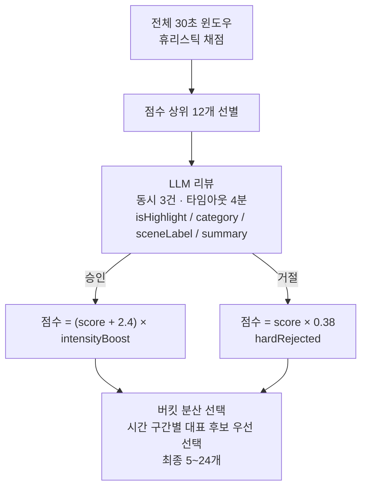
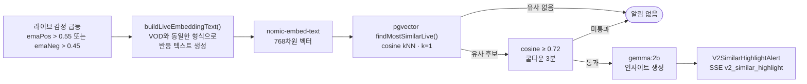
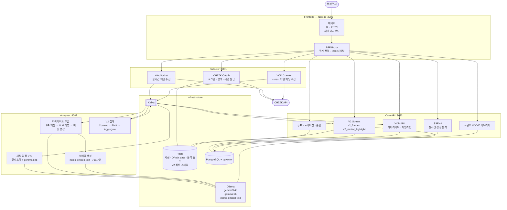
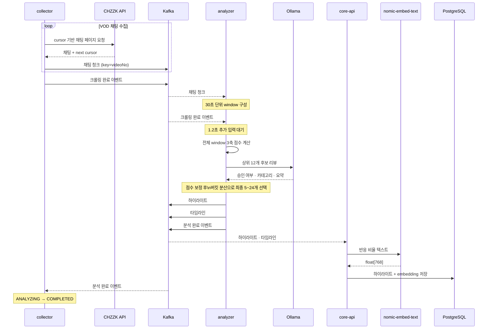
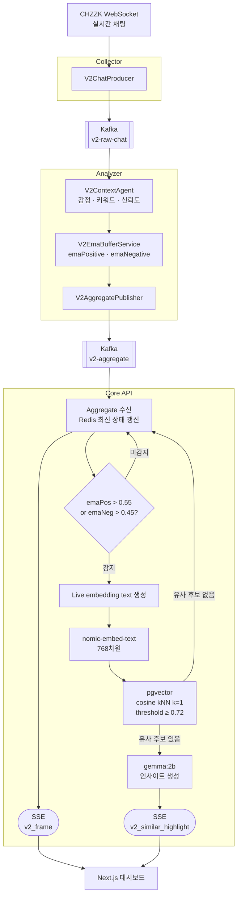
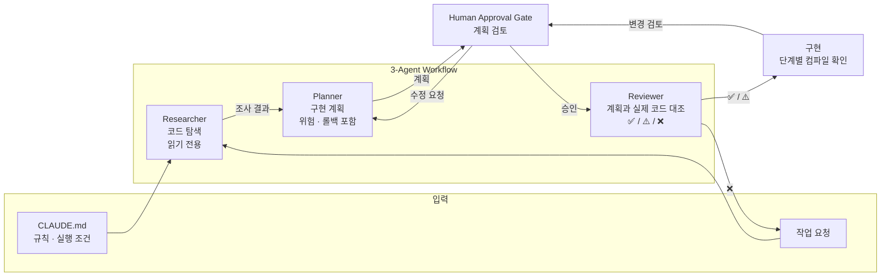

# 00. 각(Gak) — VOD 하이라이트 추출 서비스 개요

> 작성 기준: 2026-05-18

이 문서는 각(Gak)의 VOD 하이라이트 추출 원리와 주요 기술 선택을 설명합니다. 프로젝트를 살펴보는 개발자는 채팅 수집부터 후보 선별·저장·라이브 재사용까지의 흐름과 LLM 실패를 통제하는 방식을 파악할 수 있습니다.

---

## 1. 목적

방송이 끝난 뒤 스트리머가 VOD 전체를 다시 보며 편집 구간을 찾으려면 많은 시간이 필요합니다. 채팅은 시청자 반응을 확인할 수 있는 주요 데이터지만, 단순 채팅 수만으로는 해당 구간이 왜 편집할 만한지 판단하기 어렵습니다.

각(Gak)은 VOD 채팅을 수집해 **30초 단위로 반응을 정량화하고, 상위 후보를 LLM으로 검토해 편집 후보 구간을 추출**합니다.

추출한 하이라이트는 벡터로 저장합니다. 이후 라이브 방송에서 유사한 채팅 패턴이 나타나면 과거 하이라이트와 비교해 실시간 알림에 활용합니다.

전체 흐름은 **채팅 수집 → 30초 단위 채점 → LLM 후보 검토 → 시간대 분산 선별 → 결과 저장 → 라이브 유사 반응 감지**입니다. 분석 방식과 LLM 통제 정책을 먼저 설명합니다. 이어서 파라미터 조정 근거, 기술 선택, 서비스 구조를 살펴봅니다.

---

## 2. AI를 서비스에 적용한 방식

### 2-1. 채팅 반응을 3개 점수로 정량화

모든 구간을 LLM으로 분석하면 처리 시간과 호출량이 증가합니다.

각은 먼저 전체 VOD를 30초 단위로 나눠 휴리스틱 점수를 계산하고, 점수가 높은 구간만 LLM으로 검토합니다.

```text
totalScore =
    (
        intensityScore × 0.55
      + transitionScore × 0.20
      + editabilityScore × 0.25
    )
    × edgePenalty
    × negativePenalty
```

| 점수 | 측정 대상 | 주요 신호 |
|---|---|---|
| **intensityScore** | 반응이 얼마나 집중됐는가 | 채팅 밀도, 고유 발화자 수, burst 신호, 웃음·놀람·하이프·긴장 비율, Z-score |
| **transitionScore** | 직전 구간과 흐름이 얼마나 달라졌는가 | 채팅 증가율, 반응 지속 여부 |
| **editabilityScore** | 편집 후보로 활용하기 좋은가 | 메시지 다양성, 발화자 균형, 대표 채팅, 키워드 집중도·변화 |

추가로 두 가지 페널티를 적용합니다.

- `edgePenalty`: VOD 시작·종료 5분 구간의 점수를 낮춥니다. 앞뒤 맥락이 부족한 구간이 상위 후보를 차지하는 현상을 줄이기 위한 값입니다.
- `negativePenalty`: 혐오·분노 반응 비율이 높은 구간의 점수를 낮춥니다.

---

### 2-2. 휴리스틱으로 후보를 줄이고 LLM으로 최종 검토



휴리스틱만 사용하면 채팅량은 많지만 실제 편집에는 적합하지 않은 구간이 높은 점수를 받을 수 있습니다. 유행어, 반어 표현, 대화 맥락도 수치만으로 판단하기 어렵습니다.

반대로 모든 30초 구간을 LLM에 전달하면 처리 시간이 길어지고 로컬 Ollama의 요청 큐가 증가합니다.

따라서 다음 역할로 나눴습니다.

1. **휴리스틱**: 전체 구간을 빠르게 평가해 상위 12개 후보 선별
2. **LLM**: 후보의 맥락을 확인해 하이라이트 여부와 카테고리 판단
3. **버킷 분산**: 특정 시간대에 후보가 집중되지 않도록 최종 구간 분산

---

### 2-3. 채팅 원문 대신 반응 구조를 임베딩

채팅 원문을 그대로 임베딩하면 `ㅋㅋㅋ`와 같은 특정 표현이나 채널별 유행어가 유사도에 크게 반영될 수 있습니다.

이를 줄이기 위해 원문 대신 **채팅 반응을 비율과 지표로 요약한 텍스트**를 임베딩합니다.

```text
반응 구성:
웃음 45%
하이프 30%
긴장 10%
놀람 15%

채팅 밀도: 높음
고유 발화자 비율: 68%
카테고리: LAUGH
장면: 게임_클러치
감정 주도: JOY
```

이 방식은 특정 표현 자체보다 **반응의 구성과 강도**가 벡터에 반영되도록 해 채널별 표현이나 유행어에 대한 의존도를 줄입니다.

요약 텍스트는 `nomic-embed-text`로 768차원 벡터로 변환해 `vod_highlights.embedding`에 저장합니다.

---

### 2-4. VOD에서 만든 벡터를 라이브 방송에서 재사용

VOD에서 저장한 하이라이트 벡터는 이후 라이브 방송에서도 사용합니다.

라이브 채팅의 감정 신호가 일정 수준 이상 상승하면 현재 반응을 VOD와 같은 형식으로 변환해 임베딩합니다. 이후 pgvector의 코사인 유사도 검색으로 과거 하이라이트와 비교합니다.



`findMostSimilarLive()`는 VOD RAG의 유사 사례 검색과 별도의 경로입니다.

라이브 감지에서는 가장 유사한 결과 하나만 조회하는 코사인 kNN(`k=1`)을 사용합니다.

---

## 3. LLM 출력 통제

LLM 호출에서는 잘못된 JSON, 필드 누락, 범위를 벗어난 값, 응답 지연이 발생할 수 있습니다.

각은 이를 예외적인 상황으로만 처리하지 않고 **입력, 실행, 출력 단계에서 통제해야 하는 실패 유형**으로 분리했습니다.

### 3-1. 입력 제한

```text
빈 채팅 제거
    ↓
배치 최대 30개
    ↓
전체 입력 최대 3,000자
```

입력이 제한을 초과하면 크기를 줄인 입력을 사용하고 `gak.llm.batch.capped` 메트릭을 기록합니다.

기존에는 입력 크기에 제한이 없어 배치가 커질수록 고정 타임아웃 안에 응답을 받지 못하는 문제가 있었습니다.

---

### 3-2. 채팅 감정 분석의 동적 타임아웃

채팅 감정 분석 배치의 제한 시간은 입력 크기에 따라 계산합니다.

```text
timeout = min(90, 20 + batchSize × 1.5)초
```

예시는 다음과 같습니다.

- 배치 10개 → 35초
- 배치 30개 → 65초
- 최대 → 90초

고정된 제한 시간 대신 배치 크기에 따라 대기 시간을 조절합니다.

> 이 제한 시간은 **채팅 감정 분석 배치**에 적용합니다.  
> **하이라이트 후보 LLM 리뷰의 4분 제한 시간은 별도의 호출 경로에 적용합니다.**

---

### 3-3. 출력 검증

```java
// 7개 감정 키가 모두 존재하도록 보정
VALID_EMOTIONS.forEach(e -> scores.putIfAbsent(e, 0.0));

// 점수를 [0.0, 1.0] 범위로 제한
scores.replaceAll((k, v) -> Math.max(0.0, Math.min(1.0, v)));

// 모든 점수가 0에 가까우면 NEUTRAL로 처리
if (scores.values().stream().mapToDouble(Double::doubleValue).sum() < 0.001) {
    recordCount("gak.llm.output.zeroed");
    return EmotionResult.neutral(messageId);
}
```

출력 검증에서는 다음을 확인합니다.

1. 필요한 감정 키가 모두 존재하는지 확인
2. 점수를 `[0.0, 1.0]` 범위로 제한
3. 전체 점수 합이 `0.001`보다 작으면 `NEUTRAL` 반환

`NEUTRAL`은 감정이 없는 경우뿐 아니라 **정상적인 감정 판단 결과를 얻지 못했을 때 사용하는 fallback 값**도 나타냅니다.

---

### 3-4. LLM 호출 동시성 제어

초기에는 `AtomicBoolean`으로 LLM 호출 여부를 관리했습니다.

슬롯이 이미 사용 중이면 요청을 버렸지만, 어떤 요청이 얼마나 버려졌는지 확인하기 어려웠습니다.

이를 `Semaphore(1)`로 변경하고 스킵 횟수를 메트릭으로 기록했습니다.

```java
if (!llmSlot.tryAcquire()) {
    recordCount("gak.llm.batch.skipped");
    return Mono.just(List.of());
}

return doAnalyzeBatch(capped)
    .doFinally(ignored -> llmSlot.release());
```

`doFinally()`에서 슬롯을 반환하므로 성공, 실패, 취소 여부와 관계없이 세마포어를 해제합니다.

VOD 분석에는 별도의 Redis 슬롯을 사용합니다.

- 전체 동시 분석: 최대 3건
- 사용자별 동시 분석: 최대 1건

로컬 LLM에 분석 요청이 한꺼번에 몰리는 상황을 제한하기 위한 장치입니다.

---

### 3-5. Circuit Breaker

Ollama 호출이 연속으로 실패하면 Circuit Breaker가 `OPEN` 상태로 전환됩니다.

이 상태에서는 LLM을 다시 호출하지 않고 즉시 `NEUTRAL` fallback을 반환합니다.

이를 통해 LLM 장애가 채팅 처리 파이프라인 전체의 중단으로 이어지지 않도록 했습니다.

---

### 3-6. 관측 지표

| 메트릭 | 발생 조건 |
|---|---|
| `gak.llm.batch.skipped` | Semaphore 슬롯을 확보하지 못해 배치 처리 생략 |
| `gak.llm.batch.capped` | 입력 크기 또는 문자 수 제한 적용 |
| `gak.llm.output.zeroed` | 감정 점수 합이 0에 가까워 `NEUTRAL`로 보정 |

---

## 4. POC를 통한 파라미터 조정

### 4-1. 3축 가중치

초기에는 `intensityScore`만으로 상위 후보를 선택했습니다.

이 방식에서는 채팅 반응이 가장 강한 특정 시간대에 후보가 집중됐습니다. 이에 하이라이트 판단 기준을 세 축으로 분리했습니다.

- **intensity 0.55**  
  채팅 밀도와 반응 강도를 가장 큰 비중으로 반영합니다.

- **transition 0.20**  
  직전 구간과 비교해 반응이 크게 변하는 시점을 반영합니다.

- **editability 0.25**  
  발화자 다양성, 대표 채팅, 키워드 변화 등을 이용해 편집 후보로 활용하기 좋은지를 반영합니다.

현재 가중치 `0.55 / 0.20 / 0.25`는 이 기준으로 후보 결과를 비교하며 조정한 값입니다.

---

### 4-2. 시간대별 후보 분산

단순히 전체 점수 상위 N개만 선택하면 특정 시간대에 하이라이트가 집중될 수 있습니다.

이를 완화하기 위해 VOD를 4~8개 시간 버킷으로 나눕니다.

1. 각 버킷에서 대표 후보를 먼저 선택
2. 남은 개수는 전체 후보의 점수 순서대로 선택
3. 최종 5~24개의 하이라이트 생성

확인 기준은 다음과 같습니다.

- 특정 시간대에만 후보가 집중되는지
- 방송 후반부의 의미 있는 구간도 선택되는지
- 선택된 후보에 대표 채팅이 존재하는지

---

### 4-3. 라이브 유사도 임계값

라이브 유사 하이라이트 검색의 코사인 유사도 임계값은 `0.72`로 설정했습니다.

테스트 과정에서 임계값이 낮을수록 다른 유형의 반응도 유사 후보로 반환되는 경우가 늘어났고, 값을 높이면 유사한 반응 구조를 가진 후보 위주로 남았습니다.

이를 기준으로 `0.72`를 사용했습니다.

같은 반응으로 알림이 반복되는 것을 줄이기 위해 **3분 쿨다운**도 적용했습니다.

---

### 4-4. LLM 리뷰 실패 시 휴리스틱으로 복구

하이라이트 리뷰가 제한 시간 안에 끝나지 않더라도 전체 분석 결과를 실패시키지 않습니다.

LLM 리뷰가 타임아웃되면 휴리스틱 점수를 이용해 최소 5개 후보를 생성합니다.

LLM은 결과 품질을 높이는 데 사용합니다. **LLM 응답 성공 여부는 VOD 분석 완료의 필수 조건이 아닙니다.**

---

### 4-5. 단위 테스트

**OllamaAnalyzerService — 9개**

| 테스트 | 확인 내용 |
|---|---|
| `analyzeBatch_Success` | 정상 응답 파싱 및 감정 점수 매핑 |
| `analyzeBatch_PartialMissingResponse` | 누락 메시지 `NEUTRAL` fallback |
| `analyzeBatch_WithMarkdownCodeBlock` | Markdown 코드 블록 안의 JSON 파싱 |
| `analyzeBatch_WithExtraText` | JSON 앞뒤에 추가 텍스트가 있는 응답 처리 |
| `analyzeBatch_MalformedJson_Fallback` | 파싱 실패 시 전체 `NEUTRAL` fallback |
| `analyzeHighlight_Success` | RAG few-shot과 하이라이트 결과 정상 파싱 |
| `analyzeHighlight_DefaultsAndClamp` | 기본값 적용 및 intensity 범위 보정 |
| `analyzeHighlight_BlankOrMalformed_Fallback` | 빈 응답·손상된 응답 fallback |
| `analyzeHighlight_PromptLoadFailure_Fallback` | 프롬프트 로딩 실패 시 fallback 및 Ollama 미호출 |

**VodHighlightAnalyzer — 4개**

| 테스트 | 확인 내용 |
|---|---|
| `consumeCompletion_NormalizesUnknownEditorialCategory` | 알 수 없는 카테고리를 `소통`으로 정규화 |
| `consumeCompletion_ExcludesRejectedHighlights` | `isHighlight=false` 후보 제외 |
| `consumeCompletion_LlmReviewTimeoutFallsBackToHeuristics` | LLM 타임아웃 시 휴리스틱 결과 사용 |
| `consumeCompletion_ComposesSceneLabelForGachaFlex` | 가챠 키워드와 놀람 신호를 이용한 `비틱` 장면 분류 |

---

## 5. 기술 선택

### pgvector — 기존 PostgreSQL에서 벡터 검색 처리

하이라이트 정보는 이미 PostgreSQL에 저장하고 있습니다.

벡터 검색을 위해 별도의 데이터베이스를 추가하면 하이라이트 데이터와 벡터 데이터의 저장 위치가 분리됩니다. 각은 pgvector를 사용해 관계형 데이터와 임베딩을 같은 PostgreSQL에서 관리합니다.

768차원 벡터에는 IVFFlat 인덱스와 코사인 거리 연산자를 사용합니다.

```sql
CREATE INDEX ON vod_highlights
USING ivfflat (embedding vector_cosine_ops)
WITH (lists=100);
```

```sql
SELECT *
FROM vod_highlights
ORDER BY embedding <=> $queryVector
LIMIT 5;
```

현재 `lists=100`을 사용하며, 벡터 수가 증가하면 데이터 규모에 맞춰 다시 조정해야 합니다.

---

### Kafka — 채팅 순서 유지와 서비스 간 비동기 전달

VOD 채팅 이벤트에는 `videoNo`를 파티션 키로 사용합니다.

같은 VOD의 이벤트가 같은 Kafka 파티션에 전달되므로 **해당 파티션 내 이벤트 순서**를 유지할 수 있습니다.

또한 collector, analyzer, core-api가 서로 직접 동기 호출하지 않고 Kafka 이벤트를 통해 데이터를 전달하도록 구성했습니다.

Kafka 이벤트 전달로 서비스 간 직접 호출 의존성을 줄였습니다.

크롤링 완료 이벤트가 도착했더라도 앞서 발행한 채팅 청크가 analyzer에서 아직 처리 중일 수 있습니다.

따라서 analyzer는 완료 이벤트를 받은 뒤 **1.2초 동안 추가 채팅이 들어오지 않는지 확인한 후** 분석을 시작합니다.

---

### Spring WebFlux — I/O 대기가 긴 처리 경로 구성

각의 주요 작업에는 다음과 같은 대기 시간이 포함됩니다.

- LLM 응답 대기
- 임베딩 생성
- 외부 API 요청
- Kafka 이벤트 처리

이 경로를 Reactor 기반으로 구성해 I/O 대기 중 스레드를 계속 점유하는 구조를 피했습니다.

블로킹 DB 드라이버를 사용해야 하는 경로에서는 `Schedulers.boundedElastic()`으로 작업을 분리해 이벤트 루프에서 블로킹 작업을 실행하지 않도록 했습니다.

---

### Redis — VOD 분석 슬롯을 여러 인스턴스에서 공유

VOD 분석은 LLM과 임베딩 서버를 사용하므로 요청이 동시에 몰리면 처리 시간이 증가할 수 있습니다.

이를 제한하기 위해 Redis에 분석 슬롯을 저장합니다.

- 전체 최대 3건
- 사용자별 최대 1건
- TTL 30분

애플리케이션 메모리의 `ConcurrentHashMap` 대신 Redis를 사용해 여러 서버 인스턴스가 같은 슬롯 상태를 확인할 수 있도록 했습니다.

Redis 장애 시 VOD 분석은 `fail-open`으로 처리합니다.

```java
redisService.acquireSlot(ownerId)
    .onErrorReturn(SlotResult.ACQUIRED);
```

슬롯 상태를 확인하지 못했다는 이유만으로 VOD 분석 자체를 차단하지 않기 위한 선택입니다.

반대로 인증 세션 확인은 Redis 장애 시 `401`을 반환하는 `fail-secure` 정책을 적용합니다.

같은 Redis 장애라도 보호 대상에 따라 기본 동작을 다르게 설정했습니다.

---

### ChatLlmClient — LLM 호출 구현 분리

기존에는 `OllamaAnalyzerService`가 Ollama HTTP API 형식에 직접 의존했습니다.

이를 `ChatLlmClient` 인터페이스와 구현체로 분리했습니다.

```text
ChatLlmClient
 ├─ OllamaChatClient
 ├─ OpenAIChatClient   // 추가 가능
 └─ ClaudeChatClient   // 추가 가능
```

세마포어, 타임아웃, 출력 검증과 같은 서비스 정책은 상위 서비스 레이어에 유지합니다.

각 LLM의 HTTP 요청·응답 형식만 클라이언트 구현체가 담당합니다.

따라서 다른 공급자를 사용하려면 해당 `ChatLlmClient` 구현체를 추가하고 설정을 통해 사용할 구현체를 선택할 수 있습니다.

---

## 6. 전체 아키텍처



---

## 7. VOD 데이터 흐름



---

## 8. V2 실시간 채팅 분석



스파이크 알림의 3분 쿨다운은 인메모리 `ConcurrentHashMap`에 저장하므로 애플리케이션을 재시작하면 초기화됩니다.

반면 최신 V2 프레임은 Redis의 `gak:v2:state:{roomId}`에 저장합니다. 브라우저가 처음 접속했을 때 다음 Kafka 이벤트를 기다리지 않고 최근 상태를 반환하기 위한 캐시입니다.

---

## 9. AI 개발 워크플로우

코드 생성 AI가 바로 파일을 수정하지 않도록 **탐색 → 계획 → 사람 검토 → 검증 → 구현** 단계로 작업을 나눴습니다.



### Researcher

코드베이스를 탐색하고 변경 대상과 의존 관계를 정리합니다.

사용 가능한 도구를 읽기 작업으로 제한합니다.

- `read_file`
- `grep`
- `list_directory`

파일을 직접 수정할 수 없습니다.

### Planner

Researcher의 조사 결과를 받아 다음 내용을 정리합니다.

- 수정 대상 파일
- 구현 순서
- 위험 요소
- 롤백 방법
- 검증 방법

### Human Approval Gate

계획이 완성돼도 바로 파일을 수정하지 않습니다.

`EnterPlanMode`에서 계획을 검토하고 사람이 `ExitPlanMode`를 승인한 뒤 다음 단계로 진행하도록 `CLAUDE.md`에 규칙을 정의했습니다.

### Reviewer

계획서와 실제 코드 구조를 비교합니다.

- 사실관계가 맞는지
- 수정 대상이 빠지지 않았는지
- 구현 가능한 계획인지
- 기존 동작에 영향을 주는 부분이 있는지

검토 결과는 `✅`, `⚠️`, `❌`로 구분합니다.

각 에이전트는 **별도의 Claude API 호출과 독립된 대화 컨텍스트**로 실행합니다.

Researcher의 보고서는 Planner에게, Planner의 계획서는 Reviewer에게 전달합니다. 각 산출물은 다음 단계의 입력이 됩니다. 컨텍스트를 분리해 이전 대화 전체가 암묵적으로 전달되는 것을 막습니다. 각 단계에는 필요한 정보만 명시적으로 전달합니다.

실행 결과는 `workflow_output/`에 저장해 각 단계에서 어떤 조사와 판단이 이루어졌는지 확인할 수 있도록 했습니다.
